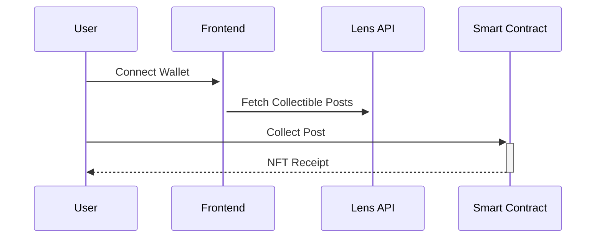

# LensCollective 🌿
A Web3 content curation platform built on Lens Protocol where users can collect and organize valuable posts.

[](https://opensource.org/licenses/MIT)
[](https://gitpod.io/#https://github.com/Dafalah01/lenscollective)

## The Story
**Problem:** On traditional social platforms, valuable content gets lost in endless feeds.  
**Solution:** LensCollective filters the noise, showcasing only collectible content from Lens Protocol and turning engagement into on-chain collections.


## ✨ What It Does
- **Curated Feed**: Only shows posts with collectible content
- **Smart Collections**: Organize saved posts into groups
- **On-Chain Profile**: Your collections become part of your Web3 identity

## ⚙️ How It Works
1. Users connect wallet (ConnectKit)
2. Browse filtered feed of collectible Lens posts
3. Collect posts (stored on-chain)
4. Organize into groups in profile



---

## Tech Stack
### Core Dependencies
| Package | Version | Purpose |
|---------|---------|---------|
| `@lens-protocol/react-web` | ^2.3.2 | Lens Protocol integration |
| `connectkit` | ^1.9.0 | Wallet connection UI |
| `wagmi` + `viem` | ^2.15.2 | Ethereum interactions |
| `@tanstack/react-query` | ^5.76.1 | Data fetching |
| `react-router-dom` | ^7.5.3 | Client-side routing |

## 🚀 Run It Yourself

### Prerequisites
- Node.js v18+
- MetaMask atau Coinbase Wallet

### Quick Start
```bash
git clone https://github.com/Dafalah01/lenscollective.git
cd lenscollective
npm install
npm run dev
```
